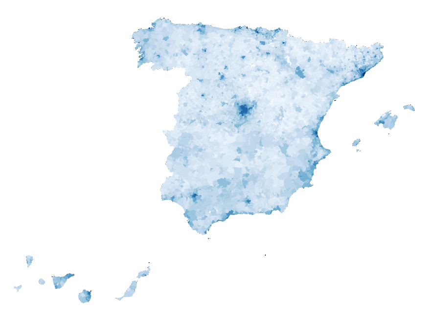

# Spain Chrolopleth

Our boss is happy with the work we have done so far... it's time to hop in showing more data,
in this case we want to display a map where you

Time to start playing with [Chrolopleth maps](https://en.wikipedia.org/wiki/Choropleth_map)



Codesadbox: https://codesandbox.io/s/eager-moore-s5dbw

# Steps

- We will take as starting example _00-boilerplate_, let's copy the content from that folder and execute _npm install_.

```bash
npm install
```

- When you deal with maps you can use two map formats GeoJSON or TopoJSON, topo JSON is lightweight and offers some extra
  features, let's install the needed packages to work with:

```bash
npm install topojson-client --save
```

```bash
npm install @types/topojson-client --save-dev
```

- Let's install topojson:

```bash
npm install topojson --save
```

```bash
npm install @types/topojson --save-dev
```

- Let's install the _composite projections_ project to display the Canary Island just below spain.

```bash
npm install d3-composite-projections --save
```

- Since we are going to use _require_ let's import _node_ typings.

```bash
npm install @types/node --save-dev
```

- Now we need the data to draw spain map by regions, you can obtain it in this address: https://github.com/Lemoncode/d3js-typescript-examples/blob/master/02-maps/03-spain-chloropleth/src/data/regions.json and save it in a newe file _./src/data/regions.json_

- Let's obtain as well the population density by municipality:https://github.com/Lemoncode/d3js-typescript-examples/blob/master/02-maps/03-spain-chloropleth/src/data/municipalities.json and save that file under _./src/data/municipalities.json_

- Let's import topojson, import the map info we have downloaded, and import the projections project that we use to place the Canary island near the Peninsula ibérica.

```diff
import * as d3 from "d3";
import * as topojson from "topojson-client";
- const europejson = require("./europe.json");
+ const spainjson = require("./data/regions.json");
+ const municipalitiesjson = require("./data/municipalities.json");
+ const d3Composite = require("d3-composite-projections");
```

- Let's create the spanish map projection (we will move Canarias from it's location):

```diff
-const aProjection = d3
-  .geoMercator()
  // Let's make the map bigger to fit in our resolution
-  .scale(500)
  // Let's center the map
-  .translate([300, 900]);
+ const aProjection = d3Composite
+ .geoConicConformalSpain()
  // Let's make the map bigger to fit in our resolution
+  .scale(3300)
  // Let's center the map
+ .translate([500, 400]);

const geoPath = d3.geoPath().projection(aProjection);
```

- Let's convert the Spain map information from topojosn to geojson:

```typescript
const geojson = topojson.feature(spainjson, spainjson.objects.ccaa);
```

- Let's create some typings to get help when typing our code (strong typing + intellisense):

- First we will import _GeometryCollection_ entity and some helper function from topojson:

_./src/index.ts_

```typescript
import { Topology, GeometryCollection, Objects } from "topojson-specification";
import { Feature, Geometry } from "geojson";
import { presimplify, simplify, feature } from "topojson";
```

- Now let's add the typings.

_./src/index.ts_

```typescript
// Let's add some typings based on TopoJson data structure
interface Municipality {
  name: string;
  rate: number;
}

interface MunicipalityData extends Objects {
  municipios: GeometryCollection<Municipality>;
}
```

- Now comes an interesting part, so far we have created linear or ordinal scales, this time:
  - We will use an sqrt scale to better display the differences (once the example is completed you can play uncommenting other scales and check results)
  - We will let d3 to calculate the background color based on the values (Given a number t in the range [0,1], returns the corresponding color from the “Blues” sequential color scheme represented as an RGB string)

_./src/index.ts_

```typescript
// Lets implement a scale to assign color to
// each municipality based on its population density.
// This time, instead of manually setting the domain,
// let's compute it dynamically from the data.
const densities = municipalitiesjson.objects.municipios.geometries.map(
  g => g.properties.rate
);
const densityExtent = d3.extent(densities);
const densityScale = d3
  //.scaleLinear()
  //.scaleLog()
  //.scalePow()
  .scaleSqrt() // more info about scales: https://observablehq.com/@d3/continuous-scales
  .exponent(1 / 6)
  .domain(<any>densityExtent)
  .range([0, 1]);
const colorScale = (density: number) =>
  // Given a number t in the range [0,1], returns the corresponding color from the “Blues” sequential color scheme represented as an RGB string.
  d3.interpolateBlues(densityScale(density || 0)); // e.g. Try interpolateReds, interpolateCool
```

- Now let's first paint the map:

```typescript
// Let's paint first the map
svg
  .selectAll("path")
  .data(geojson["features"])
  .enter()
  .append("path")
  .attr("class", "region")
  // data loaded from json file
  .attr("d", geoPath as any);
```

- Let's run the example and check that the map is displayed:

```bash
npm start
```

- Now let's go for the municipalities + rate fill rendering.

- To make easier iterating over the features and values we can use the "feature" method from topojson

```typescript
// (*) Lets implement the ENTER pattern for each new municipality
// to be represented with a SVG path joined to its datum.
// First, we need to extract the corresponding feature collection.

// https://www.freecodecamp.org/forum/t/d3-topojson-feature-explanation/235396/2
// A topojson file contains  a mathematical descripcion of the map and
// features that links the shapes to a given concept (e.g. countries, regions,
// municipalities, provinces)
const municipalities = feature(
  municipalitiesjson,
  municipalitiesjson.objects.municipios
);
```

- Let's wrap all this in a group

```typescript
const municipalitiesGroup = svg.append("g");
```

- Let's render them

```typescript
municipalitiesGroup
  .selectAll("path")
  // In data we get array of features (municipality name and rate value)
  // we pass that array, and in the second parameter we are indicating the key
  // in this case the name field that contains the municipality name
  .data(
    <any>municipalities["features"],
    (d: Feature<Geometry, Municipality>) => d.properties.name
  )
  .enter()
  .append("path")
  .attr("d", geoPath)
  // From the feature object we extract the rate and usig it to fill the current
  // municipality background
  .attr("fill", d => colorScale(<any>d["properties"]["rate"]));
```

# About Basefactor + Lemoncode

We are an innovating team of Javascript experts, passionate about turning your ideas into robust products.

[Basefactor, consultancy by Lemoncode](http://www.basefactor.com) provides consultancy and coaching services.

[Lemoncode](http://lemoncode.net/services/en/#en-home) provides training services.

For the LATAM/Spanish audience we are running an Online Front End Master degree, more info: http://lemoncode.net/master-frontend
